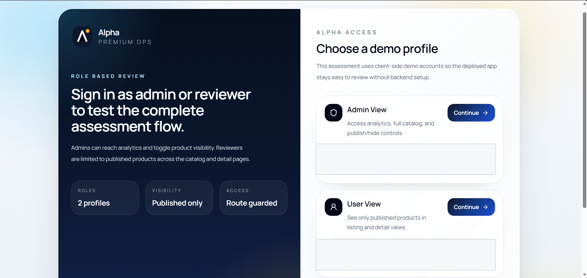

# Alpha Dashboard

Premium product operations dashboard built with React, TypeScript, Vite, and Tailwind CSS.

[Live Demo](https://alpha-commerce-dashboard.vercel.app/) | [GitHub Repository](https://github.com/codergautam900/alpha-commerce-dashboard)

## Reviewer Snapshot

Alpha Dashboard is a frontend-first SaaS-style admin workspace created for the internship assignment.

- No backend setup is required for review.
- The app includes a public landing page, demo login, analytics dashboard, product management workspace, product detail page, and cart flow.
- The review flow is intentionally simple for HR and interview panels.

## Quick Review Flow

1. Open the live demo.
2. Click `Get Started` or open `/login`.
3. Choose `Admin View` to review the full dashboard experience.
4. Check `/dashboard` for analytics cards, category chart, live updates, and sync state.
5. Check `/products` for search, category filters, rating filter, sorting, pagination, saved views, CSV export, and column controls.
6. Open any product detail page and test the gallery, stock-aware purchase flow, quantity controls, and cart updates.
7. Switch to `User View` and confirm that only published products are visible.

## Demo Access

The login page provides role-based demo entry points for easy assessment review.

| Role | Access |
| --- | --- |
| Admin View | Dashboard, full catalog, publish or hide controls |
| User View | Published products only |

Note: a few products are intentionally hidden by default so the admin and user experiences differ immediately during review.

## Assignment Coverage

| Requirement | Delivered |
| --- | --- |
| Responsive dashboard layout | Sidebar, top bar, main content area, and profile section |
| Product listing module | Product image, name, category, price, stock status, and rating |
| Search and filters | Debounced search, multi-category filters, rating filter |
| Sorting and pagination | Sort by name, price, and rating with client-side pagination |
| Product detail page | Gallery, description, category, stock, metadata, and purchase panel |
| Analytics dashboard | Total products, average rating, inventory value, category distribution |
| Performance optimization | Debounced search, `useMemo`, `useCallback`, lazy loading, query caching |
| URL state synchronization | Search, filters, sort, and page state reflected in the URL |
| Bonus features | Simulated live updates, saved views, column customization, role-aware catalog access |

## Implemented Features

### Product Management

- Product catalog powered by the DummyJSON Products API
- Search across title, brand, description, and category
- Multi-category filtering
- Minimum rating filter
- Sorting by name, price, and rating
- Client-side pagination
- Saved views with localStorage persistence
- Shareable URL-synced catalog state
- CSV export for filtered results
- Show, hide, and reorder desktop table columns

### Role-Based Review Flow

- Demo login with admin and user entry points
- Route guards for protected screens
- Admin-only analytics dashboard
- Published-only product access for standard users
- Admin publish or hide toggle from listing and detail views

### Dashboard and Insights

- Overview cards for core catalog metrics
- Category distribution chart
- Inventory value and rating insights
- Simulated live updates feed
- Manual refresh and sync status indicators

### Product Detail and Purchase Flow

- Product image gallery
- Description, tags, shipping, warranty, and metadata
- Stock-aware status badges
- Quantity controls with min and max logic
- Real-time pricing summary with discount, shipping, tax, and total
- Persistent cart drawer with update and remove actions

### UX and Quality

- Public landing page
- Dark mode with persistence
- Command palette shortcut
- Responsive desktop, tablet, and mobile layouts
- Loading, empty, and error states
- Error boundary protection
- Utility-level tests for product and cart logic

## Screenshots

### Demo Login

HR can understand the two review paths immediately from the login screen.



### Dashboard Overview

Admin dashboard with analytics, control-room presentation, and quick product access.


### Product Catalog Workspace

Role-aware product workspace with filters, URL sync, and review-friendly controls.


### Product Insights

Filtered catalog insights with export and share actions.


### Cart Drawer

Persistent order summary with live totals and checkout math.


### Mobile Catalog

Responsive mobile layout for the product workspace.


### Mobile Sidebar

Responsive mobile navigation drawer.


## Tech Stack

| Area | Tools |
| --- | --- |
| Frontend | React 19, TypeScript, Vite |
| Styling | Tailwind CSS |
| Routing | React Router |
| Server State | TanStack Query |
| HTTP | Axios |
| Charts | Recharts |
| Icons | Lucide React |
| Persistence | localStorage |
| Quality | ESLint, TypeScript strict mode, Node test runner |

## Architecture Summary

```text
alpha-dashboard/
|-- README.md
|-- LICENSE
|-- docs/
|   `-- screenshots/
`-- client/
    |-- public/
    |-- src/
    |   |-- app/          # providers, auth, theme, cart, route guards
    |   |-- components/   # analytics, layout, products, shared UI
    |   |-- hooks/        # reusable state and data hooks
    |   |-- pages/        # route-level screens
    |   |-- services/     # API layer
    |   |-- types/        # TypeScript models
    |   `-- utils/        # pure helpers and tested logic
    |-- package.json
    |-- vite.config.ts
    `-- vercel.json
```

## Routes and Access

| Route | Purpose | Access |
| --- | --- | --- |
| `/` | Landing page | Public |
| `/welcome` | Landing page alias | Public |
| `/login` | Demo profile selection | Public |
| `/dashboard` | Analytics overview | Admin only |
| `/products` | Product catalog | Admin and User |
| `/products/:productId` | Product detail page | Admin and User |
| `*` | Not found page | Public |

## Local Setup

### Prerequisites

- Node.js 18+
- npm 9+

### Run Locally

```bash
git clone https://github.com/codergautam900/alpha-commerce-dashboard.git
cd alpha-dashboard/client
npm install
npm run dev
```

Open `http://localhost:5173`.

### Environment

The project already includes [client/.env.example](client/.env.example).

```env
VITE_API_BASE_URL=https://dummyjson.com
```

## Verification

Run these commands inside `client/`.

```bash
npm run test
npm run lint
npm run build
```

## Deployment

The project is configured for Vercel deployment from the `client` directory.

- SPA routing is handled through `vercel.json`
- Security headers are already configured
- Product detail routes such as `/products/12` work after deployment

## Notes for Reviewers

- Authentication is demo-mode and handled on the client for easy assessment review.
- Product data comes from the public DummyJSON API.
- Filter state is stored in the URL so views are shareable and review-friendly.
- Current automated tests focus on business logic such as cart math and product filtering.

## License

This project is licensed under the [MIT License](LICENSE).
