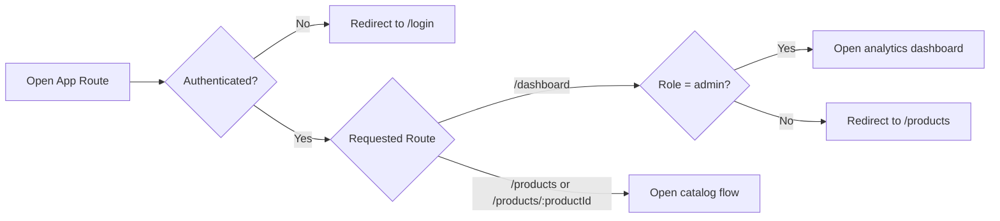
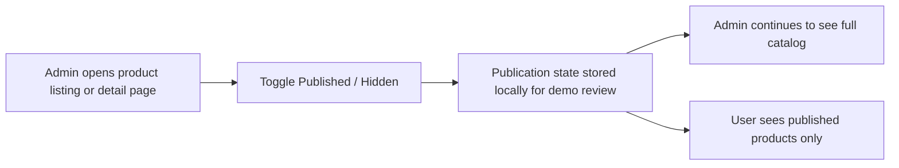

# Alpha Dashboard

Premium product operations dashboard built with React, TypeScript, Vite, and Tailwind CSS.

[](https://react.dev/)
[](https://www.typescriptlang.org/)
[](https://vitejs.dev/)
[](https://tailwindcss.com/)


[Live Demo](https://alpha-commerce-dashboard.vercel.app/) | [GitHub Repository](https://github.com/codergautam900/alpha-commerce-dashboard)

## Reviewer Snapshot

Alpha Dashboard is a frontend-first SaaS-style admin workspace created for the internship assignment.

- No backend setup is required for review.
- Client-side demo authentication is built in for reviewer-friendly access.
- The app includes a public landing page, demo login, analytics dashboard, product management workspace, product detail page, and cart flow.
- The review flow is intentionally simple for HR and interview panels.

## Quick Review Flow

1. Open the live demo.
2. Click `Get Started` or open `/login`.
3. Choose `Admin View` to review the full dashboard experience.
4. Check `/dashboard` for analytics cards, category chart, live updates, and sync state.
5. Check `/products` for debounced search, recent searches, category filters, rating filter, sorting, pagination, saved views, CSV export, comparison, and column controls.
6. Open any product detail page and test breadcrumbs, gallery, comparison toggle, stock-aware purchase flow, quantity controls, and cart updates.
7. Switch to `User View` and confirm that only published products are visible.

## Demo Access

The login page provides client-side demo authentication and role-based entry points for easy assessment review.

| Role | Access | Demo Email | Demo Password |
| --- | --- | --- | --- |
| Admin View | Dashboard, full catalog, publish or hide controls | `admin@alpha.test` | `alpha-admin` |
| User View | Published products only | `user@alpha.test` | `alpha-user` |

Reviewers can either use the role buttons on `/login` or enter the demo credentials shown above.

Note: a few products are intentionally hidden by default so the admin and user experiences differ immediately during review.

## Assignment Coverage

| Requirement | Delivered |
| --- | --- |
| Responsive dashboard layout | Sidebar, top bar, main content area, and profile section |
| Product listing module | Product image, name, category, price, stock status, and rating |
| Search and filters | Debounced search, recent search history, multi-category filters, rating filter |
| Sorting and pagination | Sort by name, price, and rating with client-side pagination |
| Product detail page | Breadcrumbs, gallery, description, category, stock, metadata, comparison, and purchase panel |
| Analytics dashboard | Total products, average rating, inventory value, category distribution |
| Performance optimization | Debounced search, `useMemo`, `useCallback`, lazy loading, query caching |
| URL state synchronization | Search, filters, sort, and page state reflected in the URL |
| Bonus features | Simulated live updates, saved views, product comparison, keyboard shortcuts, scroll-to-top, column customization, and role-aware catalog access |

## Implemented Features

### Product Management

- Product catalog powered by the DummyJSON Products API
- Search across title, brand, description, and category
- Recent search history with localStorage persistence
- Multi-category filtering
- Minimum rating filter
- Sorting by name, price, and rating
- Client-side pagination
- Saved views with localStorage persistence
- Shareable URL-synced catalog state
- CSV export for filtered results
- Compare up to three products from cards, table rows, or the detail page
- Floating comparison panel for side-by-side spec review
- Show, hide, and reorder desktop table columns

### Role-Based Review Flow

- Client-side demo authentication with admin and user entry points
- Route guards for protected screens
- Admin-only analytics dashboard
- Published-only product access for standard users
- Admin publish or hide toggle from listing and detail views

## Access Control Flow

### Protected Routes



### Publish or Hide Visibility Logic



### Dashboard and Insights

- Overview cards for core catalog metrics
- Category distribution chart
- Inventory value and rating insights
- Simulated live updates feed
- Manual refresh and sync status indicators

### Product Detail and Purchase Flow

- Product image gallery
- Breadcrumb navigation for detail pages
- Description, tags, shipping, warranty, and metadata
- Product comparison toggle from the detail view
- Stock-aware status badges
- Quantity controls with min and max logic
- Real-time pricing summary with discount, shipping, tax, and total
- Persistent cart drawer with update and remove actions

### UX and Quality

- Public landing page
- Dark mode with persistence
- Command palette shortcut
- Keyboard shortcuts help dialog with `?`
- Scroll-to-top button plus `Home` key shortcut
- Responsive desktop, tablet, and mobile layouts
- Loading, empty, and error states
- Error boundary protection
- Utility-level tests for product and cart logic

## Screenshots

### Demo Login

HR can understand the two review paths immediately from the login screen.


### Dashboard Overview

Admin dashboard with analytics, control-room presentation, and quick product access.


### Product Catalog Workspace

Role-aware product workspace with filters, URL sync, and review-friendly controls.


### Product Insights

Filtered catalog insights with export and share actions.


### Cart Drawer

Persistent order summary with live totals and checkout math.


### Product Detail Coverage

The product detail page is available at `/products/:productId` and includes:

- breadcrumb navigation
- product image gallery
- rating, stock, and category metadata
- product comparison toggle
- publish or hide control for admin users
- quantity selector with purchase math
- shipping, warranty, tags, and live cart integration

### Mobile Catalog

Responsive mobile layout for the product workspace.


### Mobile Sidebar

Responsive mobile navigation drawer.


## Tech Stack

| Area | Tools |
| --- | --- |
| Frontend | React 19, TypeScript, Vite |
| Styling | Tailwind CSS |
| Routing | React Router |
| Server State | TanStack Query |
| HTTP | Axios |
| Charts | Recharts |
| Icons | Lucide React |
| Persistence | localStorage |
| Quality | ESLint, TypeScript strict mode, Node test runner |

## Performance Optimizations Used

- Debounced search input to avoid running filter updates on every keystroke
- `useMemo` for derived catalog views, analytics, and filtered results
- `useCallback` for stable event handlers tied to filters and navigation actions
- `React.memo` for lightweight reusable presentation components used across the dashboard
- Route-level lazy loading for dashboard, products, login, and detail pages
- TanStack Query caching and background refresh for catalog data

## Architecture Summary

```text
alpha-dashboard/
|-- README.md
|-- LICENSE
|-- docs/
|   `-- screenshots/
`-- client/
    |-- public/
    |-- src/
    |   |-- app/          # providers, auth, theme, cart, route guards
    |   |-- components/   # analytics, layout, products, shared UI
    |   |-- hooks/        # reusable state and data hooks
    |   |-- pages/        # route-level screens
    |   |-- services/     # API layer
    |   |-- types/        # TypeScript models
    |   `-- utils/        # pure helpers and tested logic
    |-- package.json
    |-- vite.config.ts
    `-- vercel.json
```

## Routes and Access

| Route | Purpose | Access |
| --- | --- | --- |
| `/` | Landing page | Public |
| `/welcome` | Landing page alias | Public |
| `/login` | Demo profile selection | Public |
| `/dashboard` | Analytics overview | Admin only |
| `/products` | Product catalog | Admin and User |
| `/products/:productId` | Product detail page | Admin and User |
| `*` | Not found page | Public |

## Local Setup

### Prerequisites

- Node.js 18+
- npm 9+

### Run Locally

```bash
git clone https://github.com/codergautam900/alpha-commerce-dashboard.git
cd alpha-dashboard/client
npm install
npm run dev
```

Open `http://localhost:5173`.

### Environment

The project already includes [client/.env.example](client/.env.example).

```env
VITE_API_BASE_URL=https://dummyjson.com
```

## Verification

Run these commands inside `client/`.

```bash
npm run test
npm run lint
npm run build
```

## Testing Coverage

Current automated tests cover the most important pure business logic:

- cart reconciliation and quantity clamping against live stock
- default purchase quantity and minimum-order behavior
- stable saved-view URL normalization
- product filtering by search, category, and rating

## Deployment

The project is configured for Vercel deployment from the `client` directory.

- No signup or backend login setup is required for reviewers.
- Reviewers can use the built-in demo roles directly from `/login`.
- SPA routing is handled through `vercel.json`
- Security headers are already configured
- Product detail routes such as `/products/12` work after deployment

## Notes for Reviewers

- Authentication is demo-mode and handled on the client for easy assessment review.
- Product data comes from the public DummyJSON API.
- Filter state is stored in the URL so views are shareable and review-friendly.
- Current automated tests focus on business logic such as cart math and product filtering.
- A short live walkthrough can be provided during review if needed.

### Self-Review Setup

No external setup required — reviewers can complete the entire assessment independently:

1. **Visit the live demo** at [https://alpha-commerce-dashboard.vercel.app/](https://alpha-commerce-dashboard.vercel.app/)
2. **Test both roles** using the quick-access buttons on `/login`:
   - **Admin View** → Full catalog, analytics dashboard, publish/hide controls
   - **User View** → Published products only (visibility filtering works immediately)
3. **Verify the flow**:
   - Check `/dashboard` for analytics (admin only)
   - Explore `/products` with search, filters, saved views, and CSV export
   - Test product details at `/products/:productId`
   - Add items to cart and verify purchase math
4. **Run local tests** to validate business logic (cart math, product filtering, URL normalization)

Everything is self-contained — no API keys, databases, or backend setup needed.

## Known Limitations

- Authentication is frontend-only because this project is designed as an assessment demo, not a production auth system.
- Product data comes from the public DummyJSON API for assignment simplicity.
- Publication state is stored locally to keep the review flow fast and self-contained.

## License

This project is licensed under the [MIT License](LICENSE).
