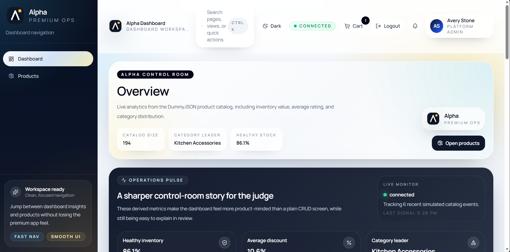
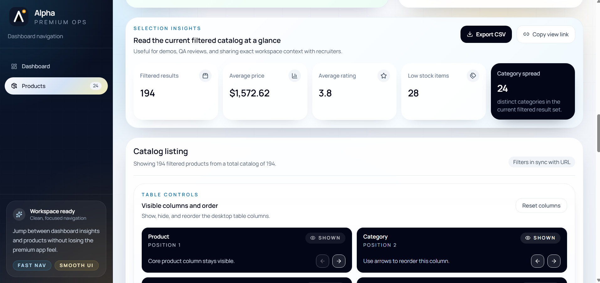
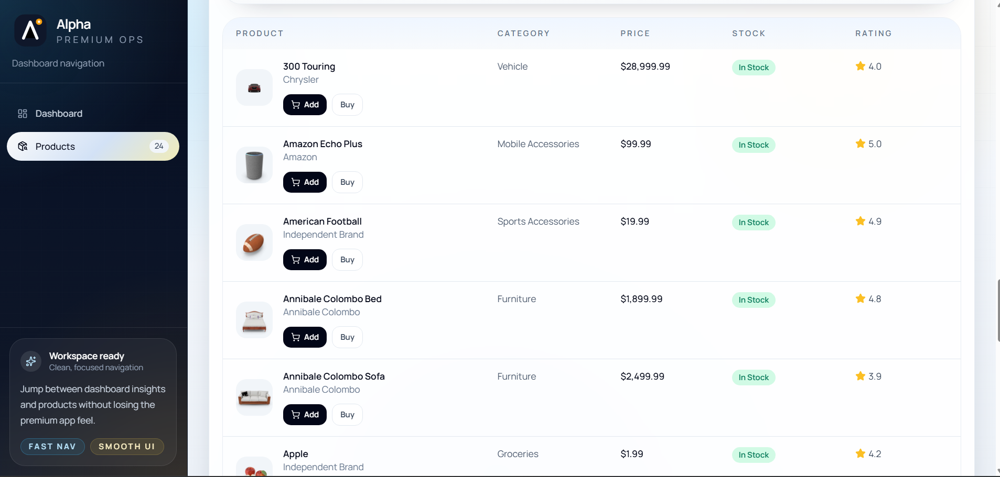
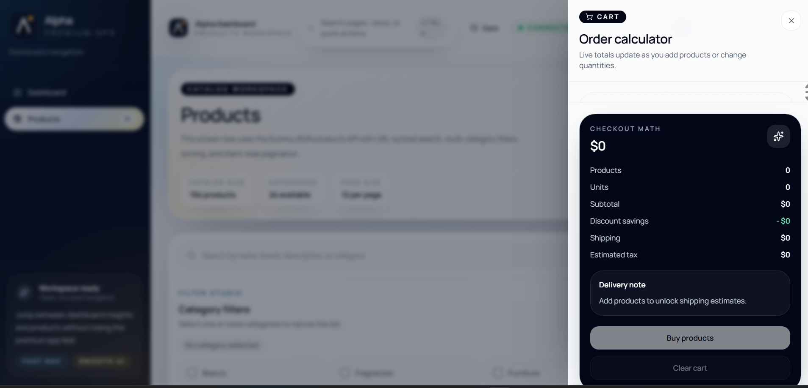
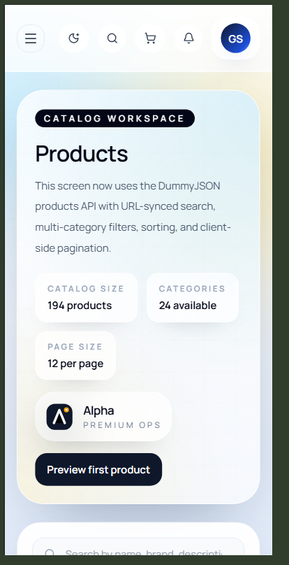
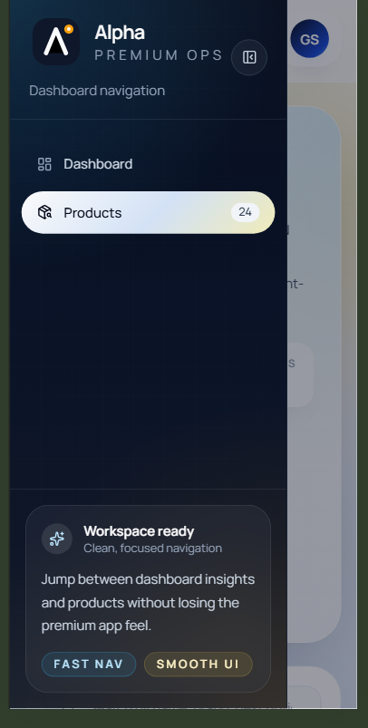

<div align="center">

# Alpha Dashboard

### Premium product operations dashboard with analytics, catalog workflows, and stock-aware purchasing

Built with React 19, TypeScript, Vite, Tailwind CSS, TanStack Query, Axios, and Recharts.

[](https://react.dev/)
[](https://www.typescriptlang.org/)
[](https://vitejs.dev/)
[](https://tailwindcss.com/)
[](./LICENSE)

[Live Demo](https://alpha-commerce-dashboard.vercel.app/) | [GitHub Repository](https://github.com/codergautam900/alpha-commerce-dashboard)

[Overview](#overview) | [Showcase](#showcase) | [Feature Matrix](#feature-matrix) | [Architecture](#architecture) | [Getting Started](#getting-started) | [Author](#author)

</div>

<p align="center">
  
</p>

## Overview

Alpha Dashboard is a frontend project designed to feel like a refined SaaS workspace instead of a basic assignment dashboard. The experience combines a premium landing flow, a data-driven control room, a filter-rich products workspace, and a stock-aware purchase planner into one cohesive interface.

The project is powered by the DummyJSON products API and focuses on three things:

- thoughtful product UX
- recruiter-friendly feature depth
- production-style frontend structure

## What Makes It Stand Out

| Area | Why It Feels Strong |
|---|---|
| Visual design | A polished control-room aesthetic with soft gradients, strong spacing, and premium product framing |
| Product thinking | Saved views, URL-linked filters, export flows, and purchase planning make the app feel intentional |
| Responsiveness | Desktop and mobile layouts preserve the character of the interface instead of collapsing into a plain fallback |
| Engineering choices | Clear route structure, reusable components, utility-level tests, and local persistence across workflows |

## Showcase

### Desktop Screens

| Overview | Filter Insights |
|---|---|
|  |  |

| Catalog Table | Cart Drawer |
|---|---|
|  |  |

### Mobile Screens

| Products Screen | Sidebar Navigation |
|---|---|
|  |  |

## Feature Matrix

### Core Product Workflows

| Capability | Details |
|---|---|
| Search and filters | URL-synced search, multi-category filtering, and stable query-state sharing |
| Sorting and pagination | Name, price, and rating sorting with 12 items per page |
| Saved views | Persist reusable filtered catalog states for repeat workflows |
| CSV export | Export the active product view directly from the workspace |
| Shareable views | Copy the current filtered URL for demos, reviews, or recruiter walkthroughs |
| Column controls | Show, hide, and reorder product table columns |

### Analytics and Monitoring

| Capability | Details |
|---|---|
| Overview cards | Catalog size, rating trends, inventory value, and category health |
| Category chart | Recharts-powered category distribution breakdown |
| Live updates feed | Simulated product events to make the workspace feel active |
| Sync status | Manual refresh actions and freshness indicators across key screens |
| Operations pulse | Additional summary storytelling beyond a plain metrics grid |

### Commerce and Detail Experience

| Capability | Details |
|---|---|
| Product detail page | Rich metadata, gallery, tags, stock state, shipping, and warranty information |
| Purchase planner | Quantity controls with discount, shipping, tax, and payable calculations |
| Cart drawer | Persistent cart with item updates, totals, and checkout-oriented summaries |
| Stock awareness | Cart and product actions adapt to available inventory and minimum order rules |

### UX Polish

| Capability | Details |
|---|---|
| Command palette | `Ctrl/Cmd + K` quick navigation and preset catalog shortcuts |
| Dark mode | Persistent theme switching for long-form workspace usage |
| Error handling | Purposeful loading, empty, invalid-route, and error states |
| Mobile UX | Locked background on sidebar open and preserved workspace feel on small screens |

## Routes

| Route | Purpose |
|---|---|
| `/` and `/welcome` | Premium landing page and product messaging |
| `/login` | Branded entry screen |
| `/dashboard` | Analytics overview with charting, sync status, and live updates |
| `/products` | Main catalog workspace with filters, insights, table controls, and export tools |
| `/products/:productId` | Detailed product page with gallery and purchase planner |

## Architecture

### Frontend Stack

| Layer | Tools |
|---|---|
| UI | React 19, TypeScript |
| Build | Vite 8 |
| Styling | Tailwind CSS |
| Routing | React Router DOM |
| Data fetching | TanStack Query, Axios |
| Visualization | Recharts |
| Icons | Lucide React |
| Testing | Node test runner for utility-level coverage |

### Project Structure

```text
.
|-- README.md
|-- LICENSE
|-- docs
|   `-- screenshots
`-- client
    |-- public
    |-- src
    |   |-- app
    |   |-- assets
    |   |-- components
    |   |   |-- analytics
    |   |   |-- layout
    |   |   |-- products
    |   |   `-- ui
    |   |-- data
    |   |-- hooks
    |   |-- layouts
    |   |-- pages
    |   |-- services
    |   |-- types
    |   `-- utils
    |-- package.json
    `-- vercel.json
```

### Technical Notes

- The full catalog is fetched once so filters, sorting, analytics, and pagination work together smoothly.
- Query-string state keeps the product workspace reload-safe and shareable.
- `localStorage` is used for cart state, theme selection, saved views, and column preferences.
- Route-level structure cleanly separates the welcome flow from the authenticated-style dashboard workspace.
- Utility tests cover critical pricing and product transformation logic.

## Why This Project Works Well In A Portfolio

- It shows product taste, not just technical correctness.
- It demonstrates UX depth beyond a CRUD screen.
- It gives reviewers multiple areas to inspect: routing, API handling, filters, cart math, state persistence, charts, and responsiveness.
- It looks like something built for a real product team, which makes it memorable in demos and interviews.

## Getting Started

### Prerequisites

- Node.js 18 or newer
- npm

### Installation

```bash
cd client
npm install
npm run dev
```

The app runs locally at `http://localhost:5173`.

## Available Scripts

```bash
npm run dev
npm run build
npm run preview
npm run lint
npm run test
```

## Environment

To override the API base URL, create a `.env` file inside `client/`:

```bash
VITE_API_BASE_URL=https://dummyjson.com
```

A starter file already exists at `client/.env.example`.

## Quality Checks

Run these before pushing:

```bash
cd client
npm run test
npm run lint
npm run build
```

## Deployment

The project is ready for Vercel deployment.

Recommended settings:

- Framework preset: `Vite`
- Root directory: `client`
- Build command: `npm run build`
- Output directory: `dist`

`client/vercel.json` already handles SPA rewrites, so routes like `/products/12` continue working after deployment.

## Repository

- Live Demo: `https://alpha-commerce-dashboard.vercel.app/`
- GitHub: `https://github.com/codergautam900/alpha-commerce-dashboard`

## Author

**Gautam Sagar**

- Email: [gateaspirant8650@gmail.com](mailto:gateaspirant8650@gmail.com)
- Phone: [7900503595](tel:7900503595)

## License

This project is licensed under the MIT License. See [LICENSE](LICENSE) for details.
